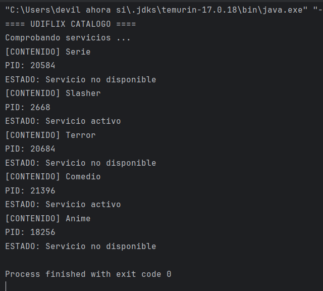

# Reto 1 · Monitor del catálogo de UDITflix

**Módulo:** 0490 · Programación de Servicios y Procesos
**Autor/a:** Rayan T.
**Reto:** ☑ Reto B (contenidos)
**Tecnología:** Java + `ProcessBuilder` (procesos del sistema operativo)
**RA vinculado:** RA1 · Programación de aplicaciones compuestas por varios procesos

> 💡 **Cómo usar este README:** no es un trámite que se rellena al final. Es mi cuaderno de pensamiento durante el reto. Las secciones marcadas con 🧠 sirven para que **piense sobre cómo estoy pensando**. Si las relleno de golpe al final, pierden valor.

---

## 📺 Qué es esta app

Un programa de consola que simula el monitor interno de UDITflix: comprueba si cada contenido del catálogo está **ACTIVO** o **CAÍDO**. Para cada uno lanza un proceso externo (`ping`), muestra su PID, lee la salida y espera a que termine.

> Captura de la consola de mi ejecución.



---

## 🧠 Antes de empezar: planifico (5 min, sin tocar el teclado)

1. **Con mis palabras, ¿qué me pide el reto?**
   Me pide crear un monitor que compruebe varios contenidos del catálogo y determine si cada uno responde correctamente o no. El programa tiene que lanzar un proceso por cada elemento y analizar el resultado del `ping`.

2. **¿Qué parte de la píldora de clase creo que voy a reutilizar?**
   Voy a reutilizar la idea de crear un proceso con `ProcessBuilder`, leer su salida con `InputStream` y comprobar el código de salida con `waitFor()`. También la lógica de identificar si un servicio está activo o caído.

3. **¿Qué parte me da más respeto o no sé por dónde empezar?**
   Lo más difícil es controlar varios procesos a la vez y hacer que el programa repita la misma lógica para cada contenido sin mezclar datos ni perder la estructura.

4. **Mi plan en 3-4 pasos, en orden:**
   1. Definir una matriz con el nombre del contenido y la dirección a comprobar.
   2. Recorrer la matriz con un `for`.
   3. Lanzar `ping` con `ProcessBuilder` y leer la salida.
   4. Interpretar el código de salida para mostrar `ACTIVO` o `CAÍDO`.

5. **Predicción:** si todas las direcciones fueran `127.0.0.1`, todos los contenidos saldrían **ACTIVO** porque esa dirección es la del loopback y responde localmente. Si fueran direcciones inexistentes o sin respuesta, todos saldrían **CAÍDO**.

---

## 🎯 Objetivo del reto

Partir de lo aprendido en la píldora (lanzar **un** proceso) y dar el salto a **gestionar varios procesos con una estructura de datos y un bucle**, aplicando: creación de procesos con `ProcessBuilder`, identificación por PID, lectura de su salida, espera con `waitFor()` e interpretación del resultado.

---

## 🛠️ Componentes y conceptos utilizados

| Componente / concepto | Para qué se usa en esta app | Con mis palabras |
|---|---|---|
| `ProcessBuilder` | Prepara la orden (`ping ...`) que se enviará al sistema operativo | Es la herramienta que me permite preparar y lanzar el comando del sistema. |
| `start()` | Lanza de verdad el proceso; devuelve un `Process` sin esperarle | Arranca el proceso, pero no lo bloquea; el programa sigue ejecutándose. |
| `Process` | Objeto con el que controlo el proceso que ya está en marcha | Representa el proceso que se ha abierto en el sistema. |
| `pid()` | Número que identifica al proceso en el sistema operativo | Es el identificador único del proceso en ejecución. |
| `getInputStream()` | Canal por el que **recibo** lo que escribe el proceso | Permite leer lo que el comando devuelve como texto. |
| `BufferedReader` + `readLine()` | Leer esa salida línea a línea | Leo la respuesta del proceso línea por línea para poder analizarla. |
| `waitFor()` | Bloquea mi programa hasta que el proceso termina y devuelve su código de salida | Espera a que termine y me dice si la comprobación tuvo éxito o no. |
| Matriz `String[][]` | Guarda, para cada elemento, su nombre y su dirección de comprobación | Es una tabla donde cada fila guarda el nombre y la dirección de un contenido. |
| Bucle `for` | Repite el mismo proceso de comprobación para cada fila de la matriz | Hace que el programa repita la comprobación para cada contenido sin escribir código repetido. |

**¿Qué contiene cada posición de mi matriz?**

```
matriz[i][0] → nombre del contenido (por ejemplo: "Serie")
matriz[i][1] → dirección a comprobar (por ejemplo: "127.0.0.1")
```

---

## 🚀 Cómo ejecutar el proyecto

1. Clonar o abrir el proyecto en IntelliJ IDEA.
2. Esperar a que indexe el proyecto.
3. Ejecutar (▶) la clase principal.

> ⚠️ El comando `ping` usa `-n` en Windows y `-c` en Linux/Mac para el número de intentos. Yo lo he probado en **Windows**.

---

## 🔍 Mientras programo: mi diario de decisiones

| Qué intentaba | Qué pasó realmente | Qué hice / qué aprendí |
|---|---|---|
| Ver el estado de cada contenido a la vez | El programa repetía la misma lógica pero no siempre hacía bien la comprobación | Usé un bucle para recorrer la matriz y evaluar cada fila por separado. |
| Leer la salida del `ping` | Al principio no la necesitaba para decidir | Aprendí que hay que leerla y mirar el código de salida para saber si la respuesta fue correcta. |
| Conseguir que cada proceso tuviera su PID | Cada ejecución del `ping` devolvía un valor distinto | Vimos que el PID cambia en cada lanzamiento y eso es normal. |

**Mi pregunta-brújula cuando me bloqueo:**
1. ¿Qué espero que haga esta línea?
2. ¿Qué está haciendo realmente? (imprimo valores para comprobarlo)
3. ¿En qué punto exacto se separan las dos respuestas?

---

## 🧭 De la píldora al reto: cómo di el salto

La píldora lanzaba **un** proceso. El reto lanza **cinco**. Este salto tenía que hacerse con una estructura que repita el mismo comportamiento para cada elemento del catálogo.

- **¿Qué tenía la píldora que ya no me sirve tal cual?**
  La idea de lanzar un proceso y leer su salida sí sirve, pero no sirve repetir la misma lógica una sola vez. Lo que necesitaba era una solución general para varias comprobaciones.

- **¿Qué he tenido que añadir para repetirlo cinco veces? ¿Por qué esa estructura y no otra?**
  He añadido una matriz `String[][]` y un bucle `for`. Así cada elemento del catálogo se procesa de la misma forma y el programa no depende de un número fijo de comprobaciones.

- **¿Qué parte del código es exactamente igual en todas las vueltas del bucle y qué parte cambia?**
  La parte igual es la creación del `ProcessBuilder`, el inicio del proceso, la lectura del `InputStream` y la comparación del estado. Lo que cambia es el nombre del contenido y la dirección que se está comprobando en esa iteración.

- **Si mañana UDITflix tuviera 500 elementos en lugar de 5, ¿qué tendría que cambiar en mi código?**
  Lo único que cambiaría es la cantidad de filas de la matriz o la forma de cargar los datos; el mecanismo del bucle y la lógica del `ping` seguirían igual. La solución es escalable.

---

## 🧠 Qué he aprendido

- **Hilo vs. proceso:** un hilo es una tarea dentro de un mismo proceso; un proceso es una ejecución independiente del sistema operativo con su propio contexto.
- **PID:** el PID es el identificador del proceso en el sistema operativo y cambia cada vez que se lanza un proceso nuevo.
- **`start()` vs. `waitFor()`:** `start()` lanza el proceso y lo deja en ejecución; `waitFor()` espera a que termine y devuelve su código de salida.
- **Código de salida:** `0` normalmente significa que el comando terminó correctamente; un valor distinto de `0` suele indicar fallo o que no hubo respuesta.
- **Lo que mi programa decide sobre ACTIVO / CAÍDO se basa en...** se basa en el código de salida del `ping` y, por tanto, en si la dirección respondió. En la práctica es bastante fiable para este caso, aunque puede fallar si la red está lenta o la dirección es temporalmente inaccesible.

---

## 🐞 Dificultades y cómo las resolví

- **Dificultad 1:**
  - Qué síntoma vi: algunos contenidos aparecían como activos aunque no deberían estarlo.
  - Cuál era la causa real: no estaba interpretando bien el resultado del proceso; asumía que la salida del texto era suficiente.
  - Cómo la encontré: revisé la lógica del `ping` y comprobé el valor devuelto por `waitFor()`.
  - Cómo evitaré que me vuelva a pasar: separar la lectura de salida del análisis del código de salida y comprobar ambos datos.

- **Dificultad 2:**
  - Qué síntoma vi: al principio no tenía claro cómo manejar varios contenidos con el mismo patrón.
  - Cuál era la causa real: estaba pensando en un caso concreto en lugar de generalizar con una estructura de datos.
  - Cómo la encontré: organicé la información en una matriz y reutilicé la misma lógica con un bucle.
  - Cómo evitaré que me vuelva a pasar: ante un problema repetitivo, buscar una estructura que abstraiga el patrón.

---

## 🪞 Autoevaluación

| Puedo explicar a un compañero... | 🔴 No | 🟡 Más o menos | 🟢 Sí |
|---|:-:|:-:|:-:|
| Qué hace `ProcessBuilder` | ☐ | ☐ | ☑ |
| Qué hace `start()` y por qué no espera | ☐ | ☐ | ☑ |
| Qué representa el PID | ☐ | ☐ | ☑ |
| Para qué sirve `getInputStream()` | ☐ | ☐ | ☑ |
| Qué hace `waitFor()` y qué devuelve | ☐ | ☐ | ☑ |
| Qué hay en cada posición de la matriz | ☐ | ☐ | ☑ |
| Qué hace el `for` en mi programa | ☐ | ☐ | ☑ |

**Mi predicción del principio, ¿acerté?** Sí. Si la dirección era `127.0.0.1`, el `ping` responde y el programa marca `ACTIVO`. Si la dirección no existe o no responde, el estado queda como `CAÍDO`.

**Lo que haría diferente si empezara de nuevo:** tendría más claro desde el principio separar la lógica de comprobación (`ping`) de la lógica de presentación (mostrar el estado). Así dejaría el código más limpio y más sencillo de modificar.

**Lo que todavía no tengo claro y quiero preguntar en clase:** aún quiero practicar más casos reales en red, por ejemplo cómo cambia el resultado con IPs de otros equipos o con nombres de dominio.

---

## 🤝 Declaración de autoría

Este reto no permite herramientas de generación de código mediante IA. Consulté únicamente: la píldora de clase, mis apuntes, la documentación de Java e IntelliJ IDEA.

☑ Confirmo que el código es mío y que puedo explicarlo línea a línea.

---

## 📂 Estructura del proyecto

```
src/main/java/org/example/   → clases del monitor de UDITflix
readme.md                   → este documento
imagenes/                  → capturas del proyecto
```

## 🔗 Enlace

- GitHub: https://github.com/Rayan-t-t/psp_udit
