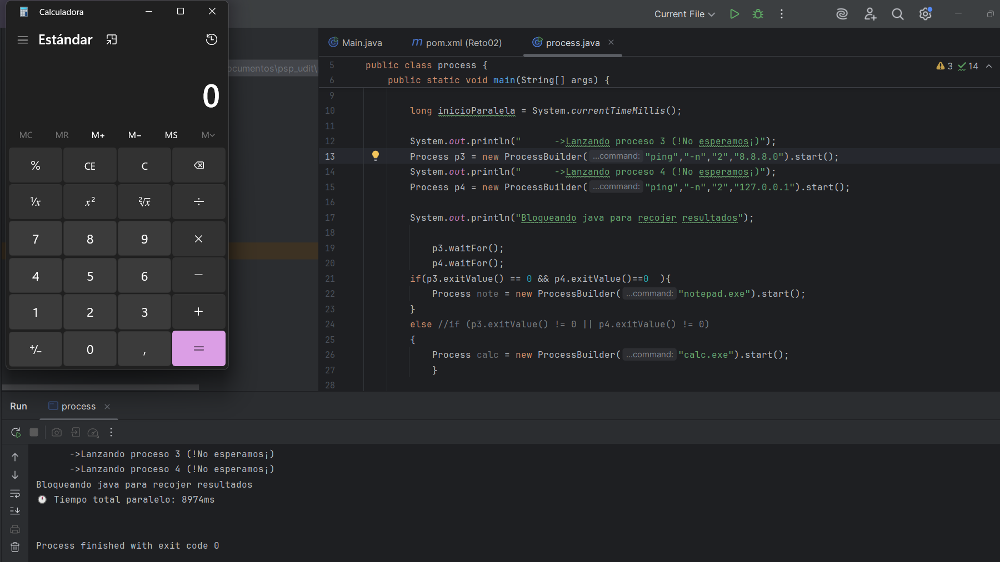

# Reto 2 · Pipeline de Auditoría UDITversum (Fase 1)

**Módulo:** 0490 · Programación de Servicios y Procesos  
**Autor/a:** Rayan Torres  
**Tecnología:** Java + `ProcessBuilder`  
**RA vinculado:** RA1 · Programación de aplicaciones compuestas por varios procesos

---

## Descripción del proyecto

Este proyecto simula una primera fase de auditoría del sistema mediante la ejecución de dos comprobaciones `ping` en paralelo. Cada una se lanza como un proceso independiente del sistema operativo y, cuando terminan, el programa comprueba sus códigos de salida.

Si ambos pings finalizan correctamente (`exitValue() == 0`), el sistema abre el Bloc de Notas. En cualquier otro caso, abre la Calculadora.

La idea principal es validar la diferencia entre:

- lanzar procesos con `start()`
- esperar a que terminen con `waitFor()`
- decidir la lógica según varios resultados simultáneos

---

## Objetivo

El reto busca pasar de ejecutar un proceso a la vez a coordinar varios procesos a la vez, aplicando:

- creación de procesos con `ProcessBuilder`
- ejecución concurrente mediante dos `start()` en secuencia
- sincronización con `waitFor()`
- lectura de códigos de salida
- decisiones usando `if` con condiciones combinadas (`&&`)
- gestión de errores con `try/catch`

---

## ¿Qué hace exactamente este programa?

El flujo es el siguiente:

1. Se lanza un proceso `ping` hacia una IP o dirección.
2. Se lanza un segundo `ping` de forma independiente.
3. El programa no espera a ninguno hasta que ambos han sido arrancados.
4. Se bloquea con `waitFor()` para recoger el resultado de cada proceso.
5. Se comprueba el valor de salida de cada uno.
6. Si ambos salen bien, se abre `notepad.exe`.
7. Si al menos uno falla, se abre `calc.exe`.

---

## Requisitos

- Java 17 o superior
- Maven
- Sistema operativo Windows para ejecutar esta versión concreta
- Comandos del sistema disponibles:
  - `ping`
  - `notepad.exe`
  - `calc.exe`

> Esta implementación está pensada para Windows porque usa `-n` en `ping` y ejecuta aplicaciones nativas del sistema.

---

## 📺 Qué es esta app

Un programa de consola que simula la primera fase de una auditoría de UDITversum. El programa:

1. Lanza dos comprobaciones (`ping`) a la vez, cada una en su propio proceso del sistema operativo.
2. Espera a que ambas terminen.
3. Lee el código de salida de cada una.
4. Según el resultado combinado, toma una decisión y abre una aplicación del sistema (Bloc de Notas o Calculadora).

```
        ┌──────────────┐
        │  Mi programa │
        │   (Java)     │
        └──────┬───────┘
               │ start()          start()
        ┌──────┴──────┐    ┌──────┴──────┐
        ▼                         ▼
  ┌───────────┐             ┌───────────┐
  │  ping A   │             │  ping B   │   ← corren a la vez
  └─────┬─────┘             └─────┬─────┘
        │ waitFor()               │ waitFor()
        └───────────┬─────────────┘
                    ▼
          ¿códigos de salida?
                    │
        ┌───────────┴───────────┐
        ▼                       ▼
   Bloc de Notas           Calculadora
```



---

## Cómo se ejecuta

Desde la carpeta del proyecto:

```bash
mvn compile
mvn exec:java -Dexec.mainClass=org.example.process
```

También se puede ejecutar directamente desde IntelliJ IDEA seleccionando la clase `org.example.process` y pulsando Run.

---

## Código clave

La lógica central del programa es esta:

```java
Process p3 = new ProcessBuilder("ping", "-n", "2", "8.8.8.0").start();
Process p4 = new ProcessBuilder("ping", "-n", "2", "127.0.0.1").start();

p3.waitFor();
p4.waitFor();

if (p3.exitValue() == 0 && p4.exitValue() == 0) {
    Process note = new ProcessBuilder("notepad.exe").start();
} else {
    Process calc = new ProcessBuilder("calc.exe").start();
}
```

Esto demuestra lo más importante del reto: los dos procesos comienzan antes de esperar resultados y la decisión final se toma después de ambos terminar.

---

## Diferencia entre secuencial y paralelo

La clave del reto está en el orden de `start()` y `waitFor()`.

### Secuencial

```java
Process p1 = new ProcessBuilder("ping", "-n", "2", "127.0.0.1").start();
p1.waitFor();

Process p2 = new ProcessBuilder("ping", "-n", "2", "8.8.8.8").start();
p2.waitFor();
```

En este caso, el programa espera a que termine el primer ping antes de iniciar el segundo. El tiempo total es casi la suma de ambos.

### Paralelo

```java
Process p1 = new ProcessBuilder("ping", "-n", "2", "127.0.0.1").start();
Process p2 = new ProcessBuilder("ping", "-n", "2", "8.8.8.8").start();

p1.waitFor();
p2.waitFor();
```

En este caso, ambos procesos arrancan casi a la vez y el tiempo total se reduce de forma significativa.

---

## 🔢 Tabla de verdad de mi decisión

| Código ping A | Código ping B | ¿Ping A OK? | ¿Ping B OK? | Condición (`&&` / `\|\|`) | Aplicación que abro |
|---|---|---|---|---|---|
| 0 | 0 | Sí | Sí | `&&` | Bloc de Notas |
| 0 | ≠ 0 | Sí | No | `&&` | Calculadora |
| ≠ 0 | 0 | No | Sí | `&&` | Calculadora |
| ≠ 0 | ≠ 0 | No | No | `&&` | Calculadora |

**¿Cambiaría el resultado de alguna fila si cambiara `&&` por `||`?** Sí. Con `||`, la aplicación que se abre sería Bloc de Notas en cualquier caso en el que al menos uno de los dos pings tenga éxito. Por eso, con `||`, la fila `0 / ≠ 0` y `≠ 0 / 0` cambiarían de Calculadora a Bloc de Notas; la fila `0 / 0` seguiría siendo Bloc de Notas, y la fila `≠ 0 / ≠ 0` seguiría siendo Calculadora.

La condición principal es:

```java
if (p3.exitValue() == 0 && p4.exitValue() == 0)
```

Esto significa que solo se abre el Bloc de Notas si las dos comprobaciones terminan con éxito. En cualquier otra combinación, se abre la Calculadora.

---

## Conceptos técnicos importantes

### `ProcessBuilder`
Permite preparar una orden que se ejecutará como proceso del sistema operativo.

### `start()`
Lanza el proceso y devuelve el control al programa inmediatamente. No bloquea la ejecución.

### `waitFor()`
Hace que el programa espere hasta que ese proceso termine y devuelve el código de salida.

### Código de salida
- `0` significa éxito
- cualquier valor distinto de `0` indica fallo o error de ejecución

### `try/catch`
Se usa para controlar errores del sistema, por ejemplo si el programa o la aplicación no existe o no puede arrancarse.

---

## Gestión de errores

El programa usa un bloque `try/catch` para capturar:

- `IOException`: cuando Java no puede iniciar el proceso
- `InterruptedException`: cuando la espera del proceso se interrumpe por una interrupción del hilo

Ejemplo:

```java
try {
    // lanzar procesos
} catch (IOException e) {
    System.out.println("Error: " + e.getMessage());
} catch (InterruptedException e) {
    System.out.println("Error: " + e.getMessage());
}
```

---

## Resumen corto

Este reto demuestra cómo Java puede coordinar procesos del sistema operativo para realizar comprobaciones en paralelo, recoger resultados y decidir la siguiente acción según esos resultados.

Es un ejemplo claro de multitarea y sincronización básica con `ProcessBuilder`, `start()`, `waitFor()` y `exitValue()`.

---

## Nota

El proyecto está pensado como ejercicio académico de programación de servicios y procesos y funciona correctamente en entornos Windows con las herramientas del sistema disponibles.
